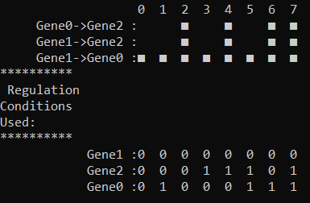
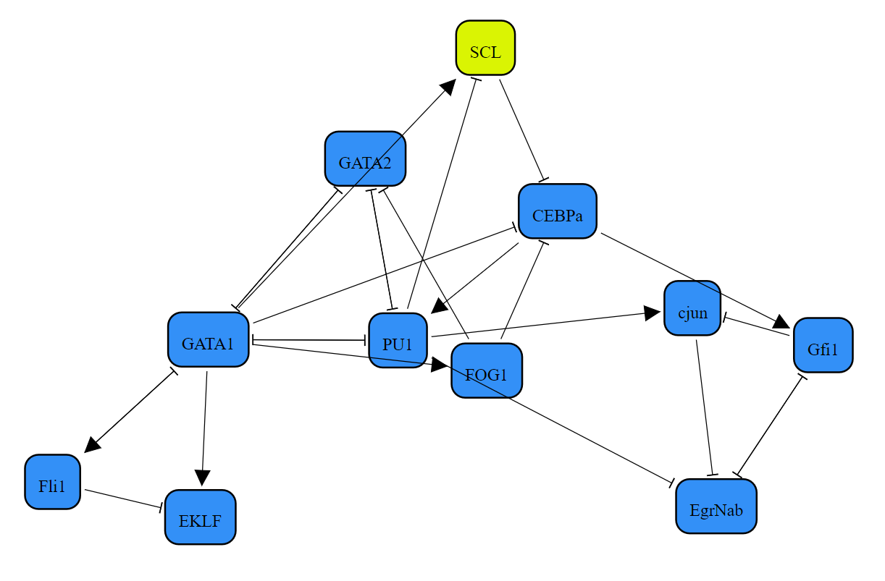

# BIU/YU Summer Research Program | Computer Science Students
Under the guidance of Dr. Hillel Kugler

>*NOTE: this README assumes prior familiarity with [RE:IN](https://www.microsoft.com/en-us/research/project/reasoning-engine-for-interaction-networks-rein/) and [BRE:IN](https://github.com/kuglerh/BREIN). For more detailed technical explanations of the concepts and ideas below, see __*

## Projects
### BRE:IN Enhancements
----------
A number of new features and improvements were implemented in the BRE:IN tool itself. Changes include:
- Broader support for regulation condition input syntax, i.e. the combination of comma-separated function numbers and '..' separated ranges
- Capability to define uniqueness of solutions by regulatory conditions used (as opposed to concrete interactions)
- Support for showing the user which regulatory conditions were used in each solution, with the option to export solutions to the BooleSim simulator or an R BoolNet network object
- A copy of the BRE:IN tool that utilizes the new [nuXmv](https://nuxmv.fbk.eu/) model checker in place of [NuSMV](https://nusmv.fbk.eu/)
### Programs Built On Top of BRE:IN
----------
We built 2 programs as abstractions on top of BRE:IN
- Pertubation Simulator
    - allows the user to view the effect of perturbating ("knocking out" or "overexpressing") every other node--or pairs of nodes--on a selected target node at a selected time step
- Minimal-Contradictory-Core (MCC) Identifier
### Inter-tool Conversions
----------
- [BioTapestry](http://www.biotapestry.org/) (.btp) Conversions
    - `BioTapestry2Brein` allows conversion from a visual BioTapestry network model to a .net input file to be fed into BRE:IN. This includes support for specification of optional interactions (represented by dotted or dashed lines in BioTapestry)
    - `BioTapestry2Rules` opens the option of generating a simulatable model using 2 inputs: the network defined in a .btp file, and the regulatory conditions defined in a .rcspec file
- RE:IN to BRE:IN
    - The `FileSplitter.py` script is a simple program to parse a RE:IN input file (.rein) and produce the 2 corresponding input files that BRE:IN expects (namely, .net and .spec)

## Usage
### Enhanced BRE:IN
----------
- The enhanced version of BRE:IN can be found in the `BREIN_nuSmv_version` directory
- It is run in the same way as the previous version of BRE:IN, with 2 optional additions:
    - To run BRE:IN with uniqueness of solutions defined by the regulatory conditions used for each node, include the following directive in the `model.net` file:
    ```
    directive uniqueness regulation_conditions;
    ```
    - The output will then look something like this:

    
    - To have BRE:IN generate rules files for each solution, which can be fed into BooleSim or BoolNet, run BRE:IN as usual with the additional `-r` flag, followed by either `bs` for BooleSim export syntax, or `bn` for Boolnet
    - The output will be a child directory of `BREIN_nuSmv_version` called `rules_<date executed>`, that holds the output files for each solution. _Note that this file generation can take a bit of time._ An example BooleSim output file (representing a solution to the myloid model) is shown below, along with the corresponding visual network:
    ```javascript
    EKLF = GATA1 && !Fli1
    PU1 = CEBPa && PU1 && !GATA1 && !GATA2
    Fli1 = GATA1
    GATA1 = (Fli1 || !GATA1) && (Fli1 || !GATA2) && (GATA1 || !Fli1) && (GATA1 || !GATA2) && (GATA2 || !Fli1) && (GATA2 || !GATA1) && (GATA2 || !PU1)
    FOG1 = GATA1
    GATA2 = GATA2 && !FOG1 && !GATA1 && !PU1
    cjun = PU1 && !Gfi1
    CEBPa = CEBPa && (!FOG1 || !GATA1 || !SCL)
    Gfi1 = CEBPa && !EgrNab
    EgrNab = (PU1 || !cjun) && (cjun || !Gfi1) && (cjun || !PU1)
    SCL = GATA1 || !PU1
    ```
    
- The copy of BRE:IN using nuXmv instead of NuSMV is located in the `BREIN_nuXmv_version` directory, and is run identically to the original version of BRE:IN
### Perturbation Simulator
----------
- After compiling the program PerturbationSimulator.java, use the following arguments to run the simulator:
```
java PerturbationSimulator <model file> <spec file> <mode> <number of perturbations> <target node> <type of perturbation> <time step>
``` 
- number of perturbations - whether the user wants to perturbate every node inidividually ('single') or every pair of nodes ('double')
- target node - the node that the user is interested in determining whether perturbating all other nodes/pairs of nodes will have an effect on it 
- type of perturbation - the options are knockout ('KO') or overexpress ('FE')
- time step - the time step at which the user is interested in predicting the target node's value

### Minimal-Contradictory-Core (MCC) Identifier
----------
- raziel fill in